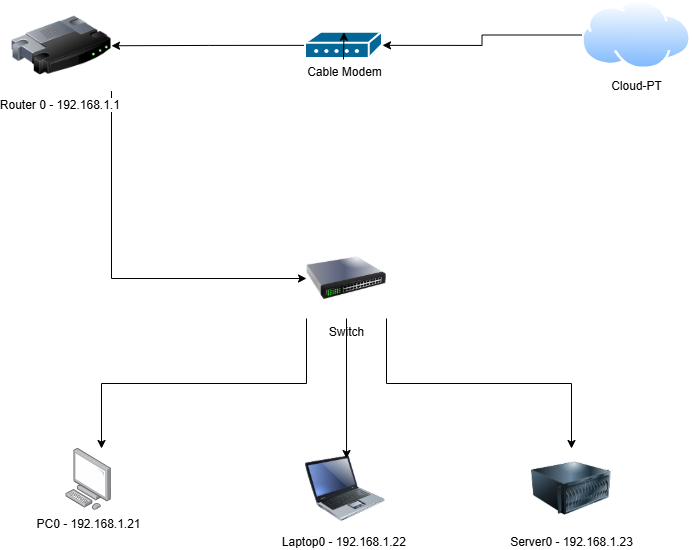
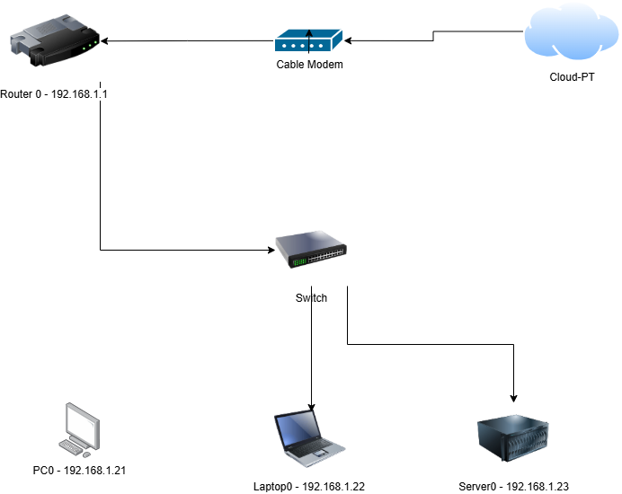
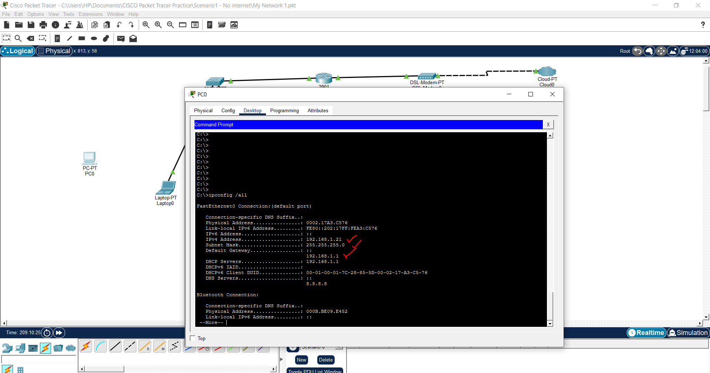
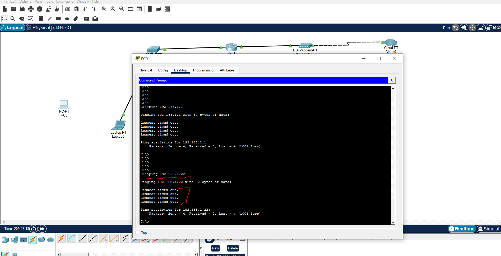
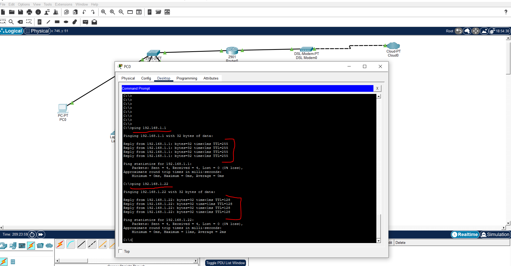

# Scenario 03: Physical Link Failure

## Incident Summary

**Date:** 03-06-2026

A workstation was unable to communicate with local network resources, the default gateway, or internet services. Investigation determined that the physical network connection between the workstation and the access switch had been disconnected.

**Severity:** High

**Affected Device:** PC0

**Environment:** Cisco Packet Tracer Lab

**Issue Type:** Layer 1 Physical Connectivity Failure

**Status:** Resolved

---

## Business Impact

The user was unable to:

* Access local network resources
* Communicate with the default gateway
* Access internet services

---

## User Report

The user reported:

> "I cannot access the internet."

> "I cannot reach any network resources."

---

## Network Topology



---

## Fault Introduced

The Ethernet cable connecting PC0 to the access switch was removed.

This simulated a Layer 1 network failure.

**Layer 1 (Physical Layer)** includes:

* Ethernet cables
* Connectors
* Network Interface Cards (NICs)
* Switch ports



---

## Investigation Process

### Step 1 – Verify TCP/IP Stack

**Command:**

```cmd
ping 127.0.0.1
```

**Result:**

```text
4 replies received
0% packet loss
```

**Screenshot:**


**Analysis:**

The TCP/IP stack is functioning correctly. The workstation can communicate with itself.

---

### Step 2 – Verify IP Configuration

**Command:**

```cmd
ipconfig /all
```

**Result:**

```text
Valid IPv4 address assigned
Valid subnet mask assigned
Valid default gateway configured
```

**Screenshot:**



**Analysis:**

The workstation has a valid network configuration. The issue is unlikely to be caused by incorrect IP addressing.

---

### Step 3 – Test Default Gateway Connectivity

**Command:**

```cmd
ping 192.168.1.1
```

**Result:**

```text
Request timed out
```

**Screenshot:**


**Analysis:**

The workstation cannot communicate with the default gateway.

---

### Step 4 – Test Connectivity to Another Host

**Command:**

```cmd
ping 192.168.1.22
```

**Result:**

```text
Request timed out
```

**Screenshot:**



**Analysis:**

The workstation cannot communicate with devices on the local network.

---

### Step 5 – Review ARP Table

**Command:**

```cmd
arp -a
```

**Result:**

```text
No ARP Entries Found
```

**Screenshot:**


**Analysis:**

The workstation is unable to discover MAC addresses on the local network.

**ARP (Address Resolution Protocol)** translates IP addresses into MAC addresses for local communication.

---

### Step 6 – Inspect Physical Connectivity

**Observation:**

The Ethernet cable between PC0 and the switch was disconnected.

**Analysis:**

A Layer 1 failure prevents all network communication regardless of correct IP configuration.

---

## Root Cause

The Ethernet cable connecting PC0 to the access switch was disconnected.

Although the workstation retained a valid IP configuration, it could not transmit or receive network traffic because the physical network link was unavailable.

---

## Resolution

1. Reconnected the Ethernet cable between PC0 and the switch.
2. Verified the switch port link became active.
3. Allowed the link to establish successfully.

**Screenshot:**


---

## Validation

### Test 1

**Command:**

```cmd
ping 192.168.1.1
```

**Result:**

```text
Successful replies received
```

---

### Test 2

**Command:**

```cmd
ping 192.168.1.22
```

**Result:**

```text
Successful replies received
```

---

### Test 3

**Command:**

```cmd
ping 8.8.8.8
```

**Result:**

```text
Successful replies received
```

**Screenshot:**



---

## Verification Checklist

* [x] Physical cable reconnected
* [x] Switch port active
* [x] Gateway reachable
* [x] Local host reachable
* [x] Network connectivity restored

---

## Lessons Learned

1. Always verify physical connectivity before investigating higher network layers.

2. A workstation can have a valid IP configuration and still be unable to communicate if the physical link is down.

3. Successful loopback testing confirms local TCP/IP functionality but does not confirm network connectivity.

4. Physical layer failures can produce symptoms similar to routing, gateway, or DNS issues.

5. Following a structured troubleshooting methodology reduces resolution time.

---

## Real-World Relevance

Physical link failures are common in enterprise environments and may be caused by:

* Unplugged Ethernet cables
* Faulty patch leads
* Damaged switch ports
* Failed network interface cards
* Incorrect workstation moves or desk relocations

A similar issue in cloud environments may be caused by:

* Detached virtual network interfaces
* Disabled network adapters
* Misconfigured virtual networking
* Disconnected VPN tunnels
