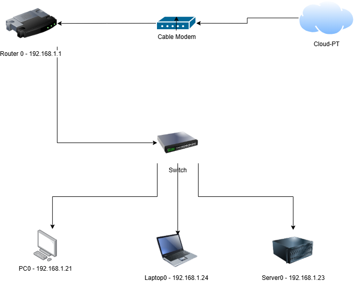
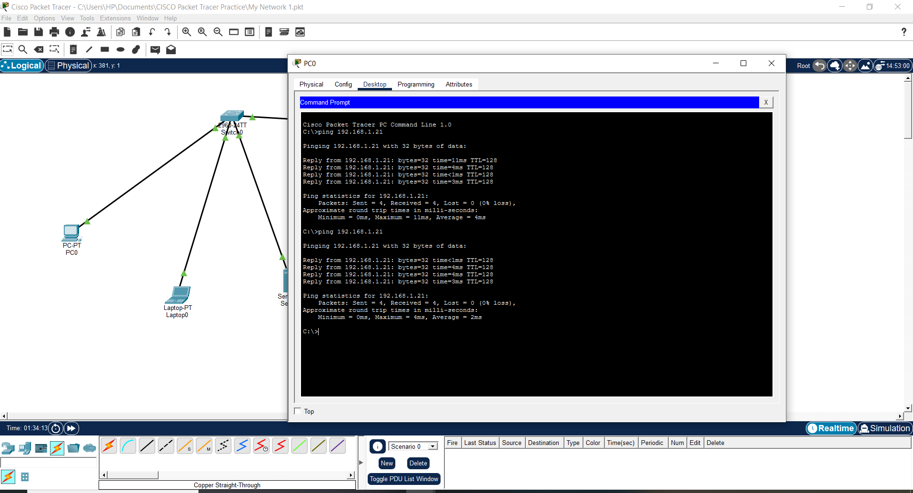
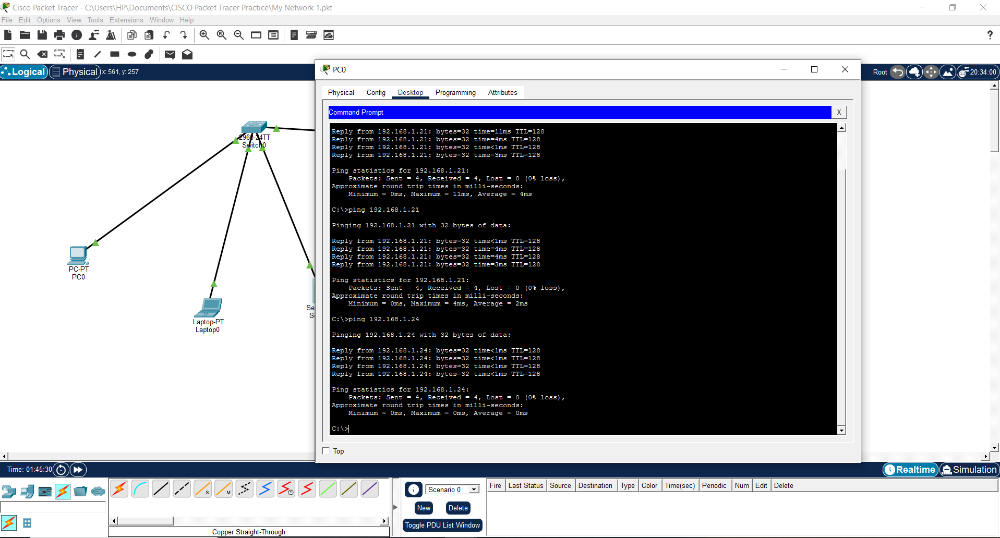
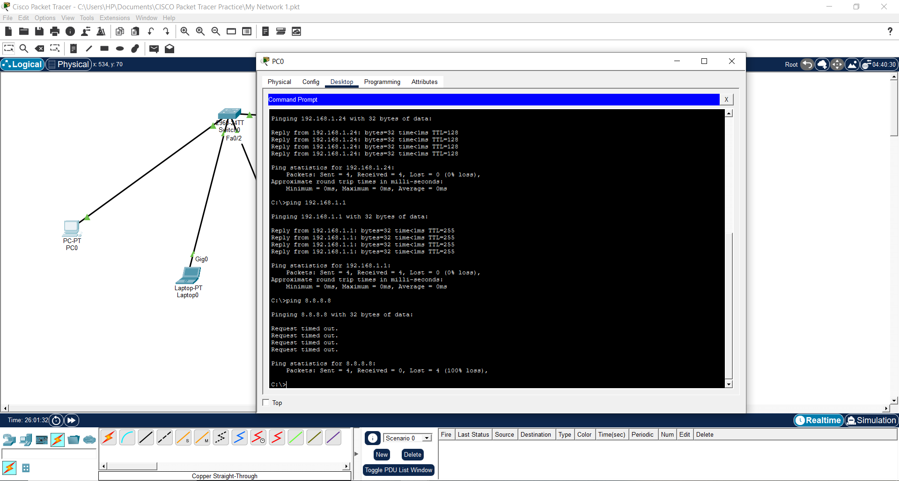
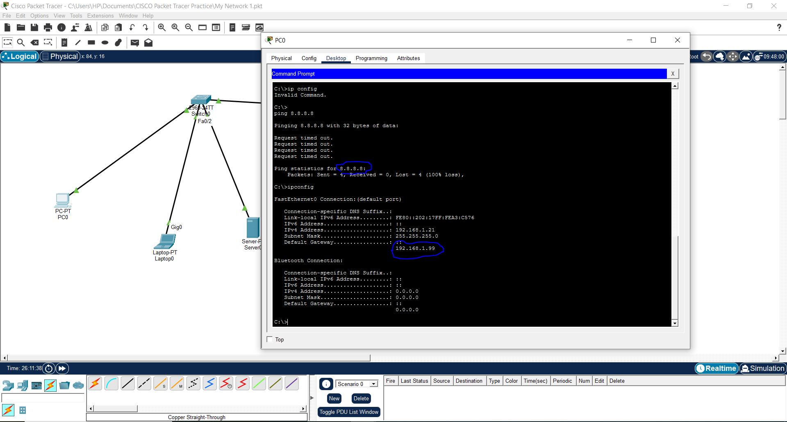
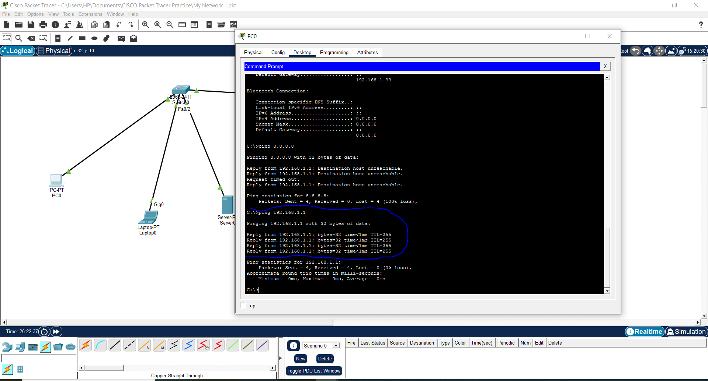

# Scenario 01: PC Cannot Reach the Internet

## Summary
**Date:** 29-05-2026
**Severity:** High — user cannot access any online services
**Simulated in:** Cisco Packet Tracer

## Problem - What User Reports
- "I can not open any websites"
- "The internet is not working"
- Local files and printers still work fine

## Network Diagram



## Diagnostic Steps


### Step 1 - Test loopback (Can PC talk to itself?)
Ping 192.168.1.21
### Result: 
```text
Pinging 192.168.1.21 with 32 bytes of data:
Reply from 192.168.1.21: bytes=32 time=11ms TTL=128
Reply from 192.168.1.21: bytes=32 time=4ms TTL=128
Reply from 192.168.1.21: bytes=32 time<1ms TTL=128
Reply from 192.168.1.21: bytes=32 time=3ms TTL=128
Packets: Sent = 4, Received = 4, Lost = 0 (0% loss)
```



### Interpretation: If replies received, the network adapter is working.


### Step 2 — Test local network
ping 192.168.1.24
### Result: 
```text
Pinging 192.168.1.24 with 32 bytes of data:
Reply from 192.168.1.24: bytes=32 time<1ms TTL=128
Reply from 192.168.1.24: bytes=32 time<1ms TTL=128
Reply from 192.168.1.24: bytes=32 time<1ms TTL=128
Reply from 192.168.1.24: bytes=32 time<1ms TTL=128
 Packets: Sent = 4, Received = 4, Lost = 0 (0% loss)
 ```



### Interpretation: PC can reach local devices. Problem is only with internet.


### Step 3 - Gateway Unreachable Test
Ping 8.8.8.8
### Result: 
```text
Pinging 8.8.8.8 with 32 bytes of data:
Request timed out.
Request timed out.
Request timed out.
Request timed out.
Ping statistics for 8.8.8.8:
    Packets: Sent = 4, Received = 0, Lost = 4 (100% loss)
```




### Step 4 — Check IP configuration
ipconfig
### Result: Default Gateway shows 192.168.1.99 — INCORRECT
Root cause identified: wrong gateway configured.



## Root Cause
Default gateway was misconfigured to 192.168.1.99.
The router's actual IP is 192.168.1.1


## Step 5 - Resolution
1. Navigate to PC IP Configuration
2. Change Default Gateway to: 192.168.1.1
3. Re-test: ping 192.168.1.1




## Verification Checklist
- [x] ping 192.168.1.1 — success
- [x] ping 8.8.8.8 — success
- [x] User confirmed internet access restored


## Lessons Learned

1. Devices on the same subnet can communicate directly without using a router. This is because both devices determine from their subnet mask that the destination IP belongs to the same local network. The sending device uses ARP (Address Resolution Protocol) to discover the destination device's MAC address and sends Ethernet frames directly through the switch. The default gateway is not involved in this process.

2. The default gateway is only used when traffic needs to leave the local network.

3. An incorrect default gateway can prevent internet access while local network communication continues to work.

4. The ping command helps identify where connectivity is failing.

5. The ipconfig command can quickly reveal incorrect network settings.

6. Troubleshooting should follow a logical process, starting from local connectivity and moving outward.


### Prevention: Use DHCP to automatically assign gateway and reduce human error.

