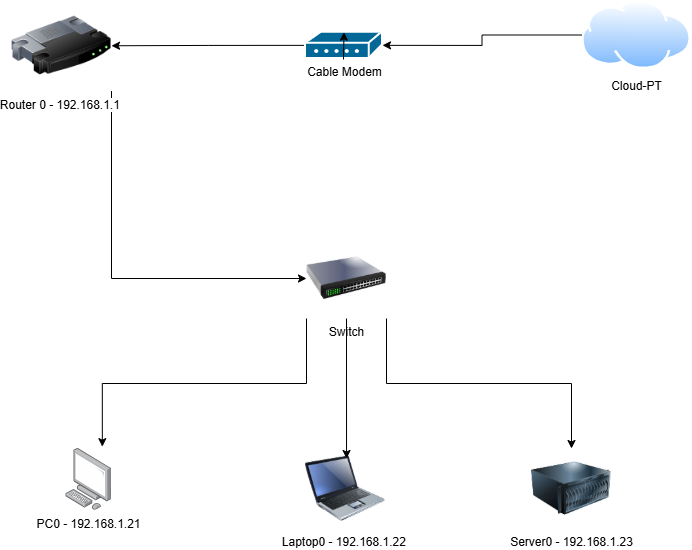
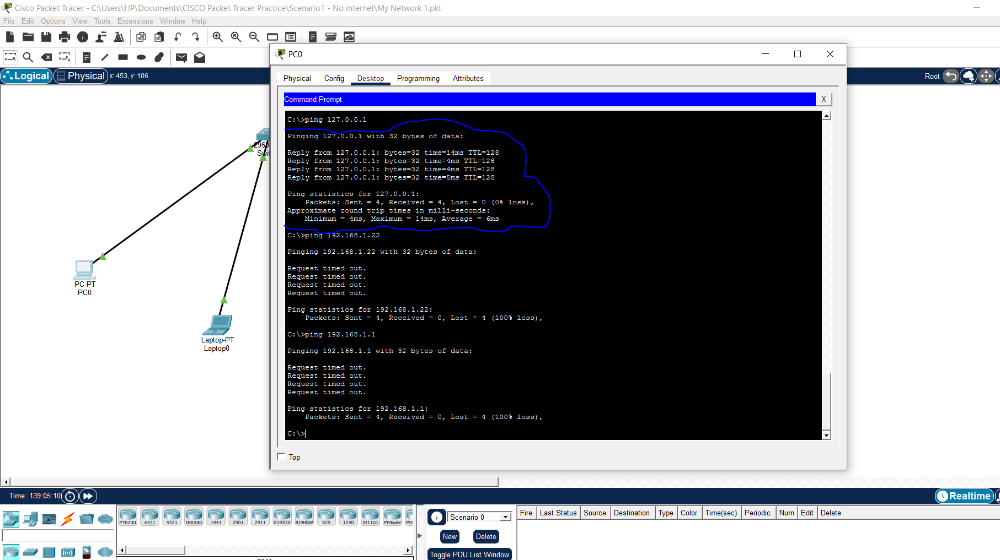
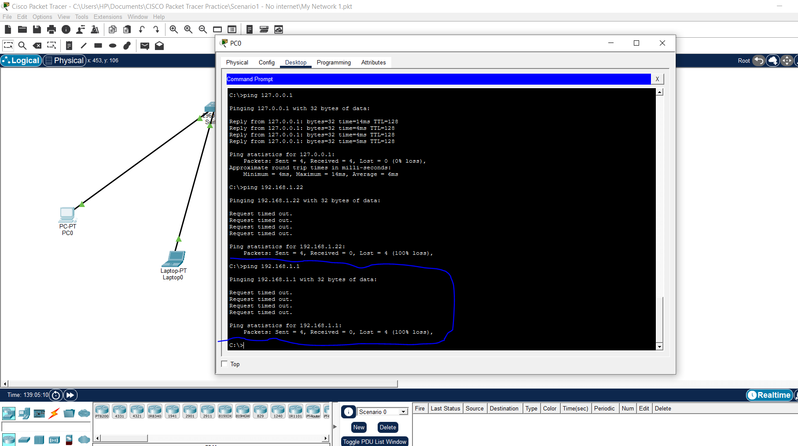
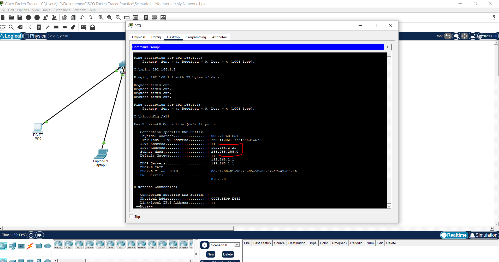
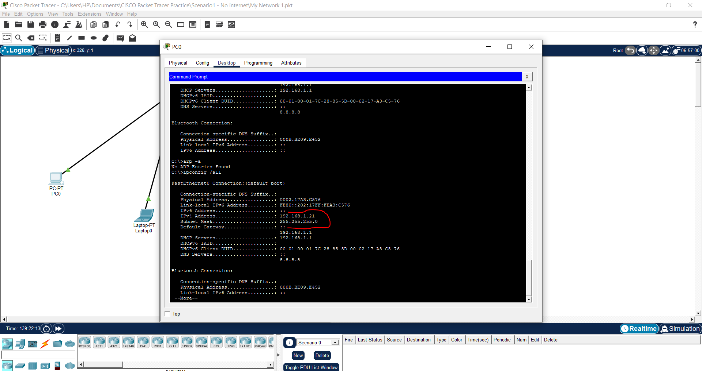
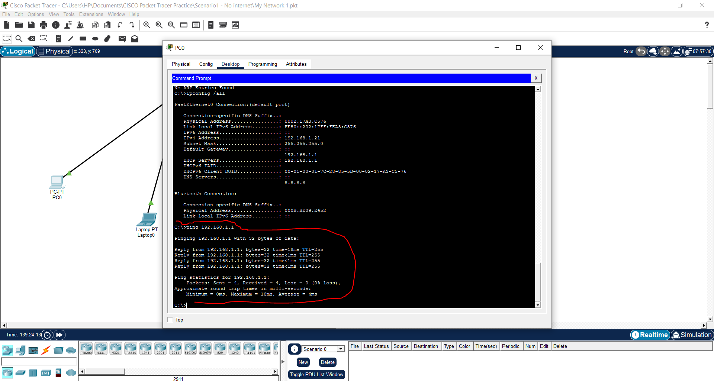

# Scenario 02: Workstation on Wrong Subnet

## Summary
**Date:** 01-06-2026

A workstation was unable to communicate with the default gateway or other devices on the network. Investigation revealed that the workstation had been assigned an IP address belonging to a different subnet than the rest of the network.


## Network Diagram



## Diagnostic Steps


### Step 1 - Test loopback (Can PC talk to itself?)
Ping 192.168.1.21
### Result: 
```text
Pinging 127.0.0.1 with 32 bytes of data:
Reply from 127.0.0.1: bytes=32 time=13ms TTL=128
Reply from 127.0.0.1: bytes=32 time<1ms TTL=128
Reply from 127.0.0.1: bytes=32 time<1ms TTL=128
Reply from 127.0.0.1: bytes=32 time=9ms TTL=128
Packets: Sent = 4, Received = 4, Lost = 0 (0% loss)
```



### Interpretation: If replies received, the network adapter is working.


### Step 2 - Gateway Reachability Test
Ping 192.168.1.1
### Result: 
```text
Pinging 192.168.1.1 with 32 bytes of data:

Request timed out.
Request timed out.
Request timed out.
Request timed out.
Ping statistics for 192.168.1.1:
    Packets: Sent = 4, Received = 0, Lost = 4 (100% loss)
```




### Step 4 — Check IP configuration
ipconfig
### Result: Wrong Subnet 192.168.2.21 — INCORRECT
Root cause identified: wrong Subnet configured.



## Root Cause
PC0 was configured with the incorrect IP address (192.168.2.21/24).
The rest of the network, including the default gateway (192.168.1.1) was operating onthe 192.168.1.0/24 subnet.
Because PC0 was placed on a different subnet, it could not communicate with the gateway or other devices on the local network.
This resulted in complete loss of network connectivity.


## Step 5 - Resolution

1. Open PC0 → Desktop → IP Configuration
2. Change IP Address from 192.168.2.21 to 192.168.1.21
3. Keep Subnet Mask as 255.255.255.0
4. Keep Default Gateway as 192.168.1.1
5. Re-test connectivity using:
   ping 192.168.1.1
   ping 192.168.1.22




## Verification Checklist
- [x] Verified PC0 IP address changed from 192.168.2.21 to 192.168.1.21
- [x] Verified subnet mask remained 255.255.255.0
- [x] Verified default gateway configured as 192.168.1.1
- [x] Ping to default gateway (192.168.1.1) successful
- [x] Ping to Laptop0 (192.168.1.22) successful
- [x] Ping to Server (192.168.1.23) successful
- [x] Network connectivity restored




## Lessons Learned

1. Devices determine whether another device is local or remote by comparing the destination IP address against their own IP address and subnet mask.

2. A subnet mask defines the network boundary. Devices on different networks cannot communicate directly and must use a router.

3. Even if the physical connection is working, an incorrect IP configuration can completely break network communication.

4. When troubleshooting, ipconfig should always be checked early because incorrect addressing is one of the most common causes of connectivity failures.

5. If the workstation cannot reach both local devices and the default gateway, verify that the IP address belongs to the correct subnet.

6. Successful ping tests after correcting the IP configuration confirm that the issue was caused by incorrect network addressing rather than a hardware fault


## Real World Relevance

This issue commonly occurs when users manually assign static IP addresses or when incorrect addressing information is entered during workstation deployment.

In enterprise environments, similar issues are frequently encountered during office relocations, network migrations, device replacements, and cloud-to-on-premises connectivity troubleshooting.

