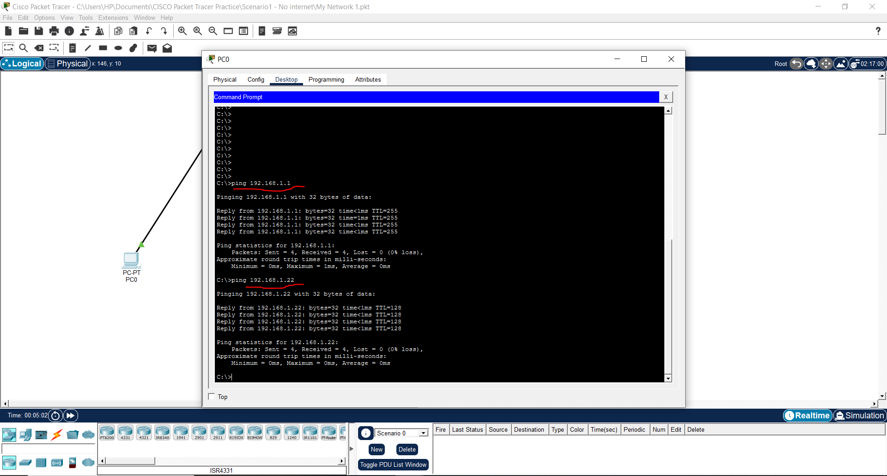
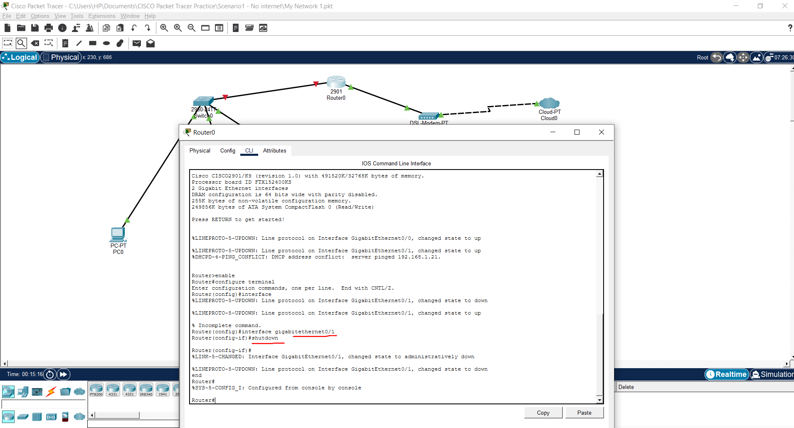
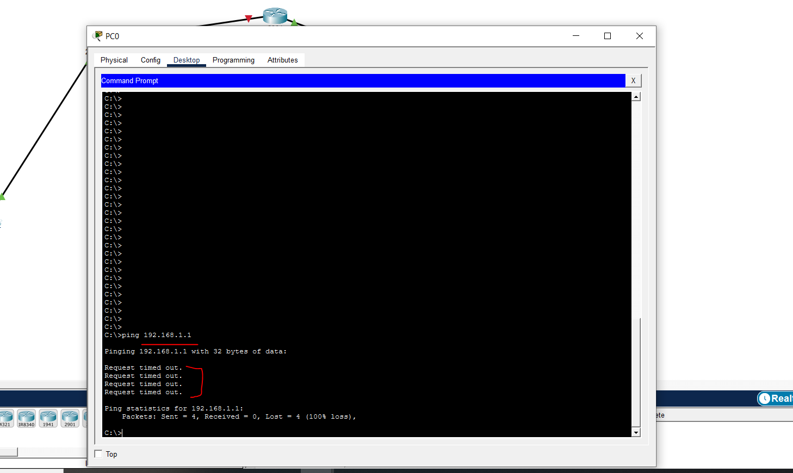
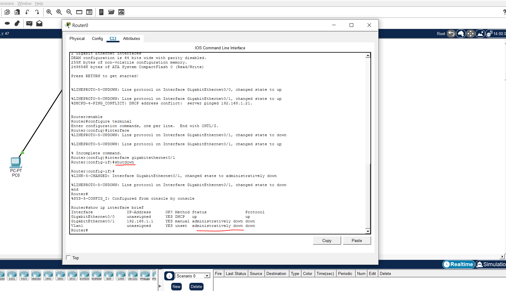
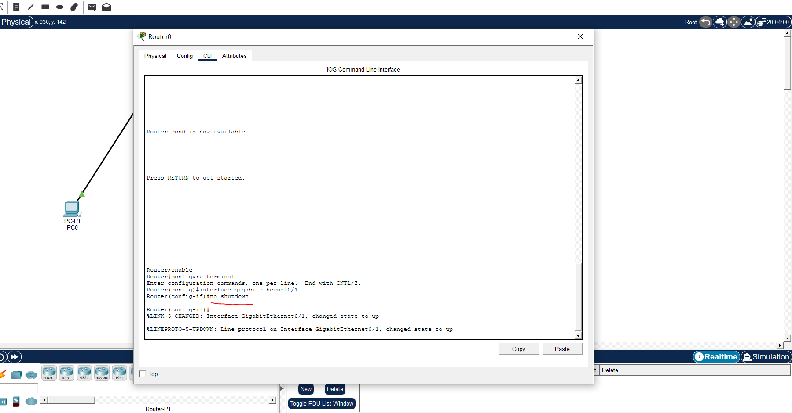
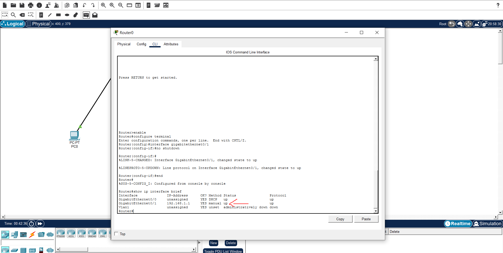
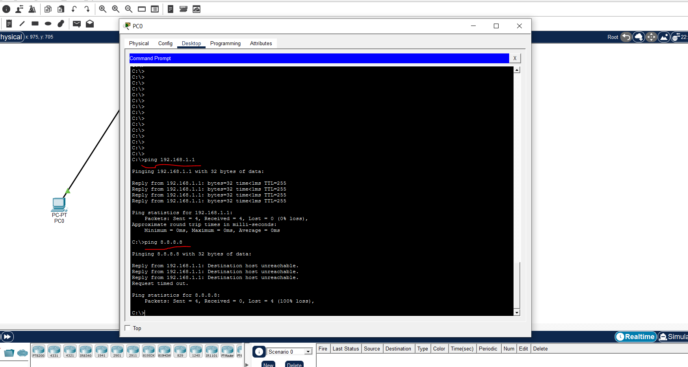

## Incident Summary

**Date:** 04-06-2026

A workstation was unable to communicate with the default gateway or access external network services. Investigation identified that the router LAN interface was administratively disabled.

**Severity:** High  
**Affected Device:** Router0  
**Environment:** Cisco Packet Tracer Lab  
**Issue Type:** Router Interface Down  
**Status:** Resolved  

---

## Business Impact

Users connected to the LAN were unable to:

- Reach the default gateway
- Access external networks
- Use internet based services

---

## User Report

The user reported:

> "The internet is not working."

> "I cannot reach the router or any external services."

---

## Network Topology



---

## Fault Introduced

The router LAN interface was manually disabled using the Cisco `shutdown` command.

```cisco
enable
configure terminal
interface gigabitethernet0/1
shutdown
end
```



## Investigation Process

### Step 1 - Test Default Gateway from PC0

**Command:**

```cmd
ping 192.168.1.1
```

**Result:**

```text
Request timed out
```

**Screenshot:**



**Analysis:**

PC0 could not reach the default gateway. This indicated that the gateway interface or the path to the gateway was unavailable.

---

### Step 2 - Check Router Interface Status

**Command:**

```cisco
show ip interface brief
```

**Result:**

```text
Interface              IP-Address      OK? Method Status                Protocol
GigabitEthernet0/0     192.168.1.1     YES manual administratively down down
```

**Screenshot:**



**Analysis:**

The router interface was not physically damaged. It had been administratively disabled using the Cisco `shutdown` command. This prevented hosts from reaching the default gateway.

---

## Root Cause

Router0 interface `GigabitEthernet0/1` was administratively disabled using the Cisco `shutdown` command.

Because this interface served as the default gateway for the LAN, all devices lost connectivity to external networks and were unable to reach the gateway address `192.168.1.1`.

---

## Resolution

The interface was re enabled using the following commands:

```cisco
enable
configure terminal
interface gigabitethernet0/1
no shutdown
end
```

**Screenshot:**



---

## Verification

### Verify Interface Status

**Command:**

```cisco
show ip interface brief
```

**Result:**

```text
Interface              IP-Address      OK? Method Status Protocol
GigabitEthernet0/0     192.168.1.1     YES manual up     up
```

**Screenshot:**



### Verify Gateway Connectivity

**Command:**

```cmd
ping 192.168.1.1
```

**Result:**

```text
4 replies received
0% packet loss
```

### Verify External Connectivity

**Command:**

```cmd
ping 8.8.8.8
```

**Result:**

```text
4 replies received
0% packet loss
```

**Screenshot:**



---

## Verification Checklist

- [x] Identified failed gateway connectivity
- [x] Tested connectivity from the workstation
- [x] Checked router interface status
- [x] Confirmed GigabitEthernet0/0 was administratively down
- [x] Re-enabled interface using `no shutdown`
- [x] Verified interface returned to up/up state
- [x] Confirmed gateway connectivity restored
- [x] Confirmed external connectivity restored

---

## Lessons Learned

1. Cisco interfaces can be disabled using the `shutdown` command.

2. The command `show ip interface brief` is one of the fastest methods for identifying interface related issues.

3. An interface showing **administratively down** indicates a configuration issue rather than a hardware failure.

4. If the default gateway interface is unavailable, hosts cannot communicate outside their local network.

5. Always verify physical and interface status before investigating higher layer issues such as DNS, routing, or firewalls.

---

## Real World Relevance

This issue frequently occurs when interfaces are disabled during maintenance activities and are not re enabled afterwards.

In cloud environments, similar symptoms can occur when a virtual network interface is disabled, detached, or incorrectly configured, resulting in loss of connectivity between systems and network services.