# Scenario 05: DNS Resolution Failure

## Incident Summary

**Date:** 10-06-2026

A workstation was able to reach devices by IP address but could not resolve website names. Investigation identified that the workstation was configured with an incorrect DNS server address.

**Severity:** Medium  
**Affected Device:** PC0  
**DNS Server:** Server0  
**DNS Server IP:** 192.168.1.23  
**Environment:** Cisco Packet Tracer Lab  
**Issue Type:** DNS Misconfiguration  
**Status:** Resolved  

---

## Business Impact

The user was unable to access websites by name, even though network connectivity was working.

---

## User Report

The user reported:

> "The internet is not working."

> "Websites do not open."

---

## Network Topology

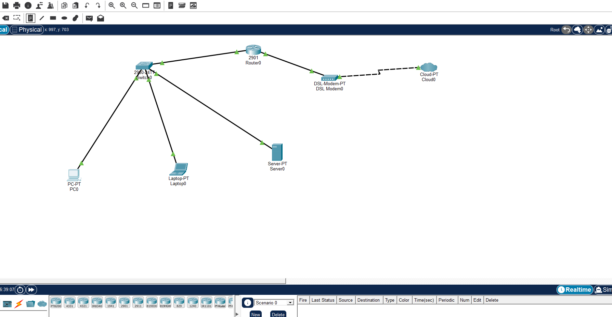

---

## DNS Configuration

Server0 was configured as the DNS server.

DNS record created:

```text
www.mynetwork.com → 192.168.1.23
```

## Working State Verification

Before introducing the fault, DNS functionality was verified to establish a known good baseline.

### DNS Server Configuration

Server0 was configured as the DNS server with the following A record:

```text
www.mynetwork.com → 192.168.1.23
```

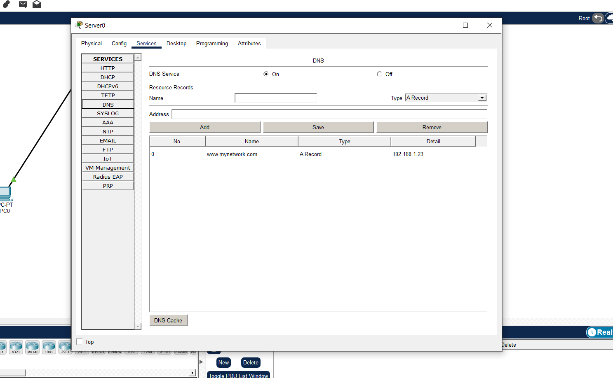

### PC0 DNS Configuration

PC0 was configured to use Server0 as its DNS server:

```text
DNS Server: 192.168.1.23
```

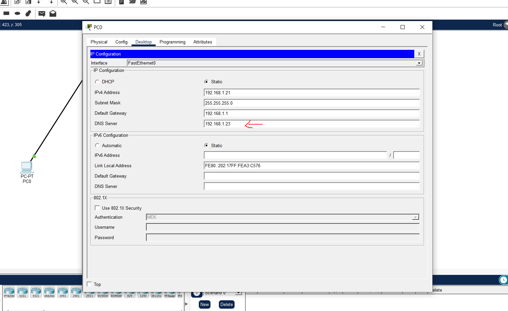

### DNS Resolution Test

Command:

```cmd
nslookup www.mynetwork.com
```

Result:

```text
Server: 192.168.1.23
Name: www.mynetwork.com
Address: 192.168.1.23
```

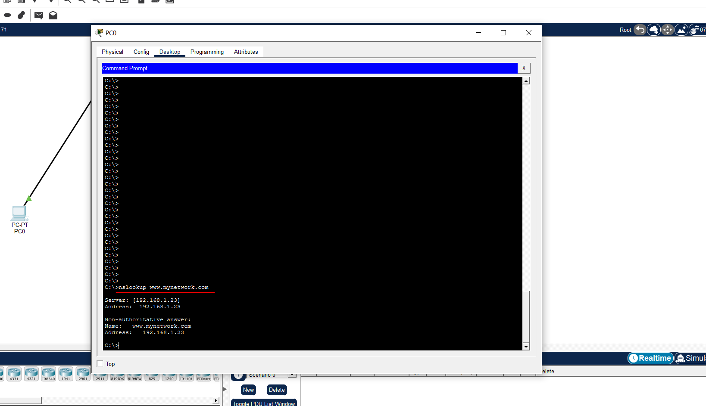

### Analysis

The DNS server successfully resolved the hostname `www.mynetwork.com` to the correct IP address of `192.168.1.23`.

This confirmed that:

* DNS service was operational on Server0
* PC0 was configured with the correct DNS server
* DNS queries were being answered successfully
* Name resolution was functioning normally prior to fault injection

A working baseline was established before introducing the DNS failure scenario.


## Fault Introduced

To simulate a DNS failure, the DNS server configuration on PC0 was intentionally changed to an invalid address.

### Change Made

PC0 DNS Server was changed from:

```text
192.168.1.23
```

to:

```text
192.168.1.99
```

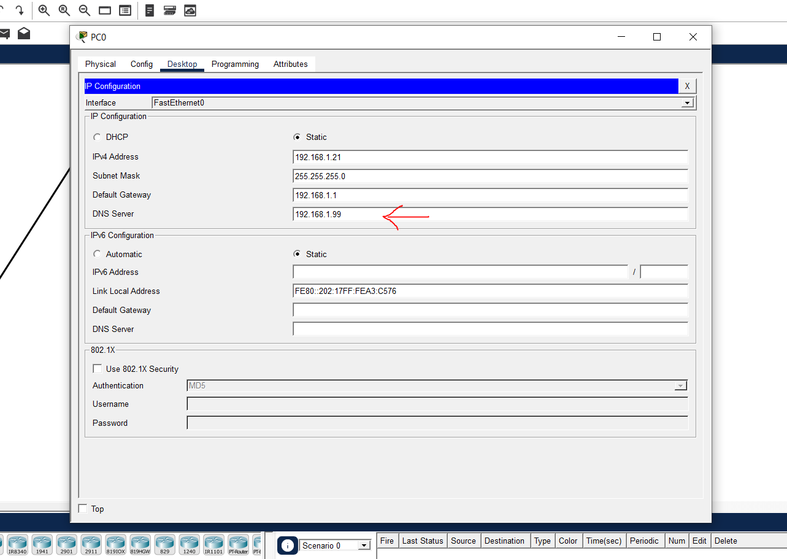

### Expected Impact

The IP address `192.168.1.99` does not exist on the network.

As a result:

* DNS queries cannot reach a DNS server
* Hostnames can no longer be resolved into IP addresses
* Internet connectivity remains functional
* Access by IP address still works
* Access by hostname fails

This creates a common real world situation where users report that websites are not working even though network connectivity is still available.

### User Reported Symptoms

* Websites fail to open
* Internet appears broken
* Ping by hostname fails
* Ping by IP address succeeds


## Investigation Process

### Step 1 – Verify Network Connectivity

Command:

```cmd
ping 192.168.1.23
```

Result:

```text
4 replies received
0% packet loss
```

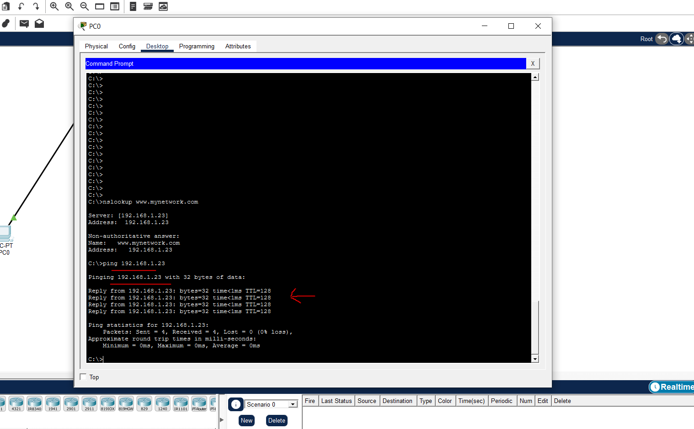

### Analysis

The destination device is reachable by IP address.

This confirms:

* Physical connectivity is working
* Switch connectivity is working
* IP addressing is correct
* Routing is functioning normally

The network itself is operational.

---

### Step 2 – Test DNS Resolution

Command:

```cmd
nslookup www.mynetwork.com
```

Result:

```text
DNS request timed out
Server: Unknown
Address: 192.168.1.99
```

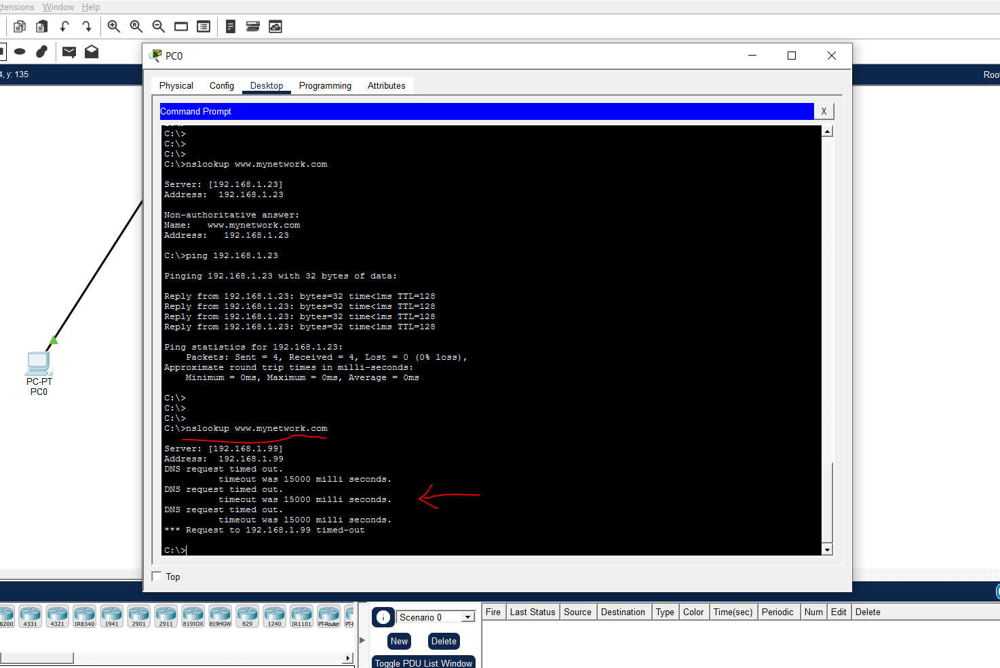

### Analysis

The DNS lookup failed because PC0 attempted to send the query to DNS server 192.168.1.99.

No device exists at that address, therefore no DNS response was received.

This indicates a DNS configuration problem rather than a connectivity problem.

---

### Step 3 – Verify DNS Configuration

Command:

```cmd
ipconfig /all
```

Result:

```text
DNS Servers . . . . . . . . . : 192.168.1.99
```

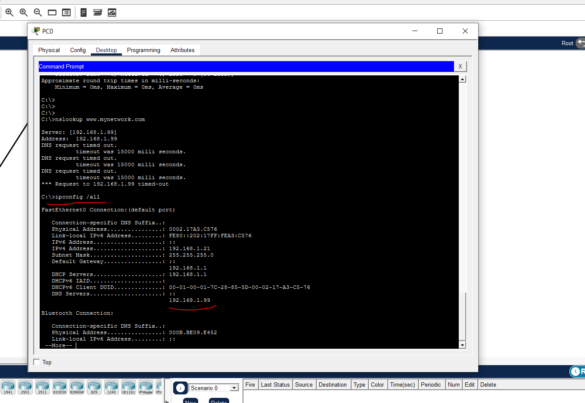

### Root Cause

PC0 was configured with an incorrect DNS server address.

DNS requests were being sent to 192.168.1.99, which does not exist on the network.

Because no DNS server was available to answer queries, hostname resolution failed.


## Resolution

### Correct DNS Server Configuration

Navigate to:

```text
PC0 → Desktop → IP Configuration
```

Change DNS Server from:

```text
192.168.1.99
```

to:

```text
192.168.1.23
```

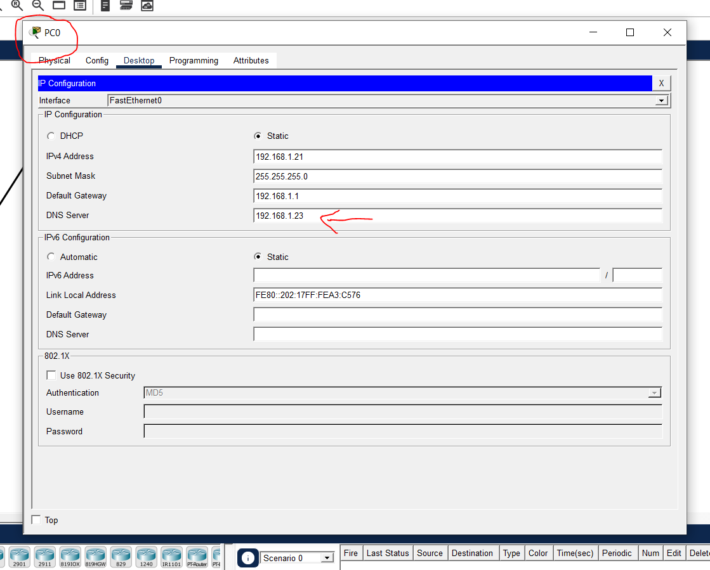

---

## Verification

### Test 1 – Verify DNS Resolution

Command:

```cmd
nslookup www.mynetwork.com
```

Result:

```text
Server: 192.168.1.23
Name: www.mynetwork.com
Address: 192.168.1.23
```

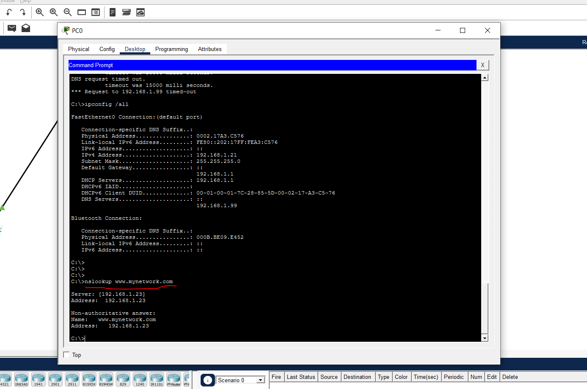

### Test 2 – Verify Connectivity

Command:

```cmd
ping 192.168.1.23
```

Result:

```text
4 replies received
0% packet loss
```

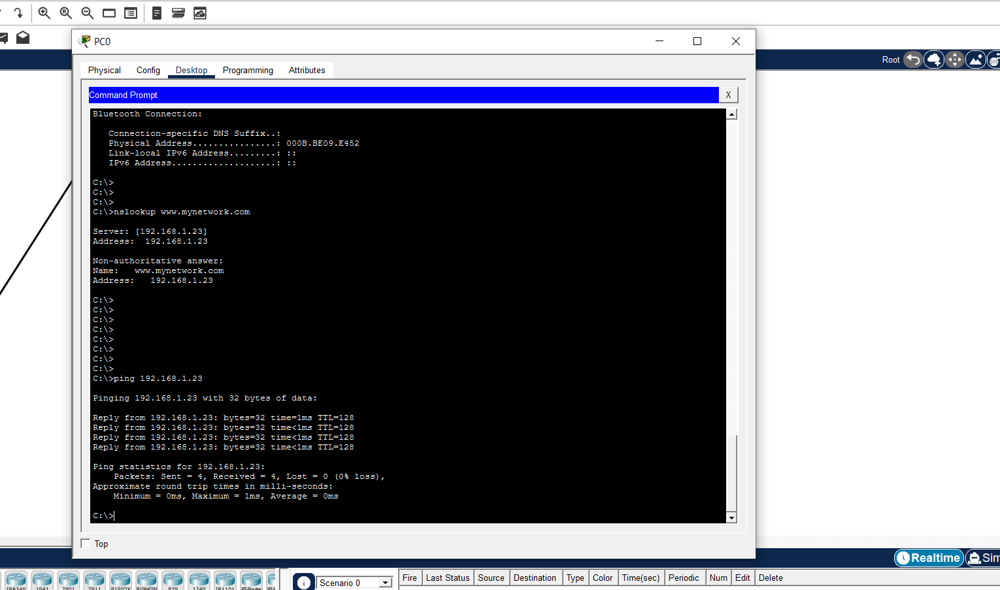

---

## Verification Checklist

- [x] DNS server address corrected
- [x] nslookup successful
- [x] Hostname resolved correctly
- [x] Network connectivity confirmed
- [x] User access restored

---

## Lessons Learned

1. DNS translates human readable names into IP addresses.

2. Network connectivity and DNS functionality are separate services.

3. Successful ping by IP but failure by hostname usually indicates a DNS issue.

4. The `nslookup` command is one of the fastest ways to identify DNS problems.

5. The `ipconfig /all` command helps verify DNS server settings on a workstation.

6. Incorrect DNS settings can make users believe the internet is down even when connectivity is fully operational.

7. DNS troubleshooting is a fundamental skill for Network Engineers, Cloud Engineers, DevOps Engineers, and Cloud Support Engineers.

---

## Cloud Relevance

This scenario directly maps to real world cloud environments.

Common examples include:

- Incorrect AWS Route 53 Resolver configuration
- Broken VPC DNS settings
- Incorrect custom DNS servers
- Azure Private DNS failures
- Internal DNS resolution issues in Kubernetes clusters

Understanding DNS troubleshooting is critical for cloud and infrastructure roles because many application outages are caused by name resolution failures rather than actual network failures.

